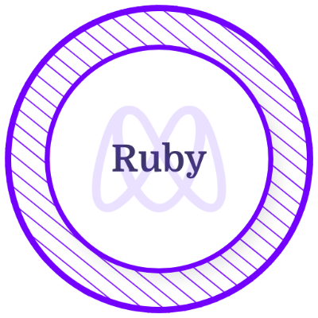

<h3 align="center"> I'm a software developer from Pakistan!</h3>

I have learned software development from Microverse. I spend most of my time learning different frameworks and technologies related to web development. I'm excited to solve world problems or invent something exciting with the power of coding that I have learned and still learning.

- 👩‍💻 I’m a **Junior Full-Stack Software Developer** trained in a remote, collaborative and multicultural environment at [Microverse.](https://github.com/microverseinc)

- 🌱 Exploring new exciting opportunities to grow and take my skills to another level. If you got an interesting offer, free feel to contact me!

- 💻 All **my projects** are available [here.](https://github.com/HammadSiddique?tab=repositories)

  
  

### 🎯 Reach me on:

&nbsp; &nbsp; &nbsp; &nbsp;  &nbsp;
 &nbsp;

### ✏ Interesting facts about me:

- **Goals**: By the end of this year, I intend to become a good full stack developer
- **Hobbies**: Sports ⚽ Gaming 🎮 Movies 🎥
- **Fun Fact**: My most used line of code is `git clone` and my only flex is `display: flex;`

<h2 align="left">Skills</h2>

  &nbsp; &nbsp; &nbsp; &nbsp;  &nbsp;  &nbsp;  &nbsp;  &nbsp; &nbsp; &nbsp; &nbsp; &nbsp; &nbsp; &nbsp; &nbsp; &nbsp; &nbsp; &nbsp; &nbsp; &nbsp; 

<h2 align="left">Certificates & Licenses</h2>

&nbsp; &nbsp; &nbsp; &nbsp;  &nbsp;  &nbsp;  &nbsp;  &nbsp;  &nbsp;  &nbsp;  &nbsp; 

<h2 align="left"> Github Stats </h2>
    
      

<h2 align='left'>Weekly Coding Stats</h2>

<!---
HammadSiddique/HammadSiddique is a ✨ special ✨ repository because its `README.md` (this file) appears on your GitHub profile.
You can click the Preview link to take a look at your changes.
--->
